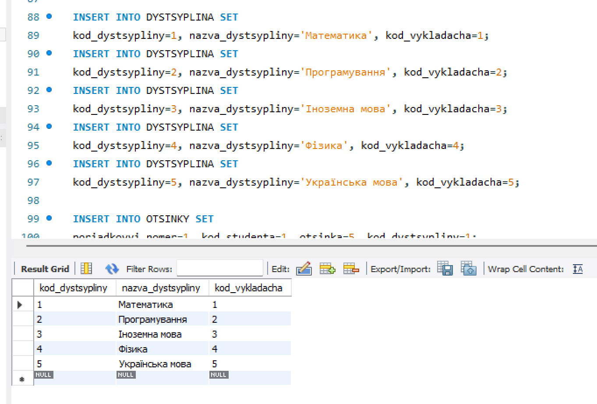

# 📂 Папка init
Ця папка призначена для початкових експериментів із Markdown.  
Тут ми тренуємося оформлювати документацію, працювати з таблицями, списками та посиланнями.

---

## 🔹 Приклад форматування тексту
- **Жирний текст**
- *Курсивний текст*
- ~~Закреслений текст~~
- `Виділений кодом`

---

## 🔹 Список робіт
1. Ознайомлення з Markdown.
2. Створення таблиць у README.
3. Додавання посилань та зображень.
4. Формування звітів по лабораторним роботам.

---

## 🔹 Таблиця з лабораторними роботами

| №  | Назва роботи                          | Статус    |
|----|---------------------------------------|-----------|
| 1  | Створення таблиць у MySQL             | ✅ Виконано |
| 2  | Використання SELECT                   | ✅ Виконано |
| 3  | Оновлення та редагування даних (UPDATE)| 🔄 В процесі |
| 4  | Видалення даних (DELETE)              | ⏳ Заплановано |

---

## 🔹 Приклад коду
```sql
CREATE TABLE Students (
    id INT PRIMARY KEY AUTO_INCREMENT,
    name VARCHAR(50),
    age INT
);
```
## 🔹 Приклад посилання 
- [посилання на файл текст](text.txt)

## 🔹 Приклад фото
- 