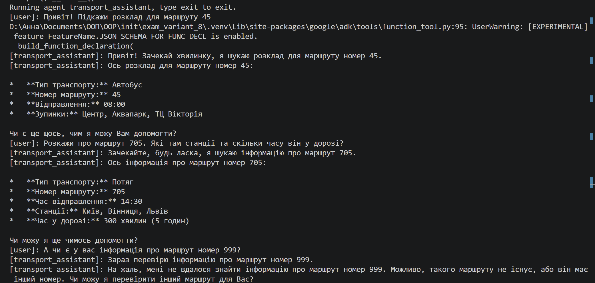

# Звіт з екзаменаційної роботи (ООП)

**Студентка:** Заворотня Анна
**Група:** КН-33
**Спеціальність:** 122 Комп'ютерні науки
**Навчальний заклад:** Фаховий коледж телекомунікацій та комп'ютерних технологій НУ «Львівська політехніка»
**Варіант:** 8 (Агент розкладу транспорту)

---

## 1. Опис виконаної роботи
* Проект успішно ініціалізовано у віртуальному середовищі.
* Залежності (`google-adk`, `python-dotenv`) встановлені за допомогою менеджера пакетів `pipenv`.
* Створено необхідну структуру проекту, включаючи файли `.env` (з API ключем) та `.gitignore`.
* Реалізовано ієрархію класів з використанням усіх 4 парадигм ООП:
  * **Абстракція:** Базовий абстрактний клас `Transport` з абстрактним методом `get_schedule()`.
  * **Наслідування:** Класи `Bus` та `Train` успадковують базовий клас `Transport`.
  * **Поліморфізм:** Метод `get_schedule()` має власну реалізацію для автобусів та потягів (повертає різний набір даних).
  * **Інкапсуляція:** Клас `Schedule` зберігає маршрути у приватному атрибуті-словнику `__routes`.

---

## 2. Демонстрація роботи агента

---

## 3. Лістинг коду (agent.py)
[посилання на файл з програмою](agent.py)