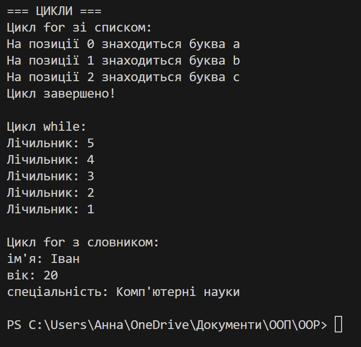
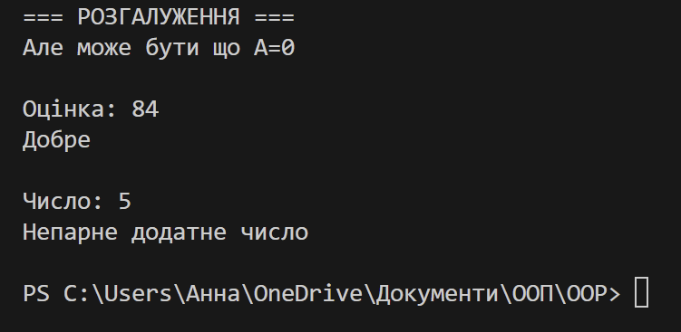
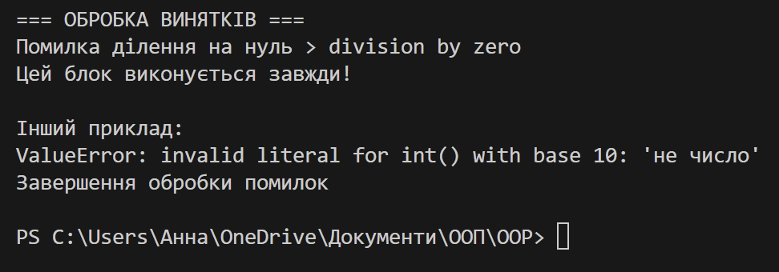
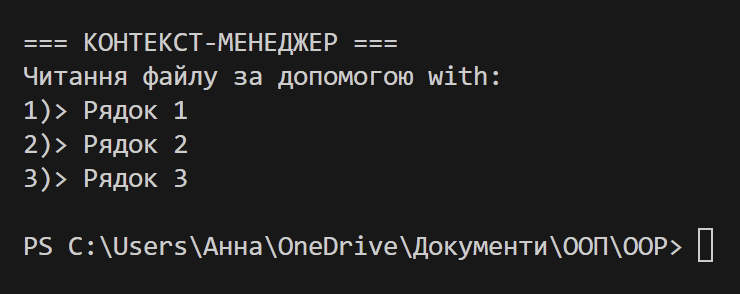
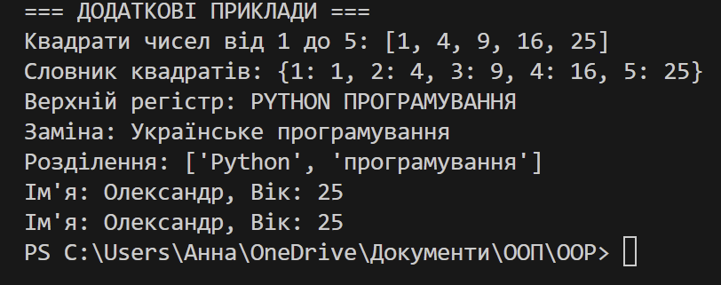

# **Тема:** Основи програмування на Python
## **Мета:** Навчитись застосовувати основні конструкції мови Python, виконати всі приклати та з використанням AI створити власні приклади які демонструють особливості кодових конструкцій Pyhton
### Виконання роботи:
- #### **Основні типи данних**
```python
print("=== ОСНОВНІ ТИПИ ДАНИХ ===")

a = "змінна з текстом"
b = 1  # числова змінна
b1 = 1.1 
c = ["a", 1, 1.25, "Слово", a]  # List
d = {"a": "Слово", "b": 1, "змінна з текстом": b}  # Dict
e = ("a", a)  # Tuple
f = {"ss", a + " test"}  # Set

print("String:", a)
print("Integer:", b)
print("Float:", b1)
print("List:", c)
print("Dict:", d)
print("Tuple:", e)
print("Set:", f)
print()
```


- #### **Вбудовані константи та зарезервовані слова**
```python
print("=== КОНСТАНТИ ТА КЛЮЧОВІ СЛОВА ===")

print("Перша константа:", True)
print(f"Як можна так робити вивід? {False}")
print("None:", None)
print("Ellipsis:", ...)


import keyword
print("\nПерші 10 зарезервованих слів Python:")
print(keyword.kwlist[:10])
print()
```


- #### **Вбудовані функції**
``` python
print("=== ВБУДОВАНІ ФУНКЦІЇ ===")

print(abs(-12.5), f"є рівним {abs(12.5)}", "і якщо порівняти то:", abs(-12.5) == abs(12.5))
print("Довжина рядка:", len("Hello World"))
print("Максимум з чисел:", max(5, 10, 2, 8))
print("Сума списку:", sum([1, 2, 3, 4, 5]))
print()
```


- #### **Цикли**
```python
# 4. Цикли
print("=== ЦИКЛИ ===")

# Цикл for зі списком
letters = ["a", "b", "c"]
print("Цикл for зі списком:")
for i in range(len(letters)):
    print(f"На позиції {i} знаходиться буква {letters[i]}")
else:
    print("Цикл завершено!")

# Цикл while
print("\nЦикл while:")
counter = 5
while counter > 0:
    print(f"Лічильник: {counter}")
    counter -= 1

# Цикл for з словником
print("\nЦикл for з словником:")
student = {"ім'я": "Іван", "вік": 20, "спеціальність": "Комп'ютерні науки"}
for key, value in student.items():
    print(f"{key}: {value}")
print()
```


- #### **Розгалуження**
```python
# 5. Розгалуження
print("=== РОЗГАЛУЖЕННЯ ===")

from random import randint

# Просте if-else
A = randint(0, 1)
print(f"Значить А={A}" if A else f"Але може бути що А={A}")

# if-elif-else
grade = randint(1, 100)
print(f"\nОцінка: {grade}")

if grade >= 90:
    print("Відмінно!")
elif grade >= 75:
    print("Добре")
elif grade >= 60:
    print("Задовільно")
else:
    print("Незадовільно")

# Вкладені умови
number = randint(-10, 10)
print(f"\nЧисло: {number}")
if number > 0:
    if number % 2 == 0:
        print("Парне додатне число")
    else:
        print("Непарне додатне число")
elif number < 0:
    print("Від'ємне число")
else:
    print("Нуль")
print()
```


- #### **Обробка винятків**
```python
# 6. Обробка винятків
print("=== ОБРОБКА ВИНЯТКІВ ===")

A = 0
try:
    print("Що буде якщо", 10/A, "?")
except ZeroDivisionError as e:
    print("Помилка ділення на нуль >", e)
except Exception as e:
    print("Інша помилка >", e)
finally:
    print("Цей блок виконується завжди!")

# Інший приклад
print("\nІнший приклад:")
try:
    number = int("не число")
except ValueError as e:
    print(f"ValueError: {e}")
finally:
    print("Завершення обробки помилок")
print()
```


- #### **Контекст-менеджер**
```python
# 7. Контекст-менеджер with
print("=== КОНТЕКСТ-МЕНЕДЖЕР ===")

# Створюємо файл для прикладу
with open("example.txt", "w") as f:
    f.write("Рядок 1\nРядок 2\nРядок 3")

# Читаємо файл за допомогою контекст-менеджера
print("Читання файлу за допомогою with:")
try:
    with open("example.txt", "r") as f:
        for line_number, line in enumerate(f, 1):
            print(f"{line_number})> {line.strip()}")
except FileNotFoundError:
    print("Файл не знайдено")
print()
```


- #### **Лямбда-функції**
```python
# 8. Лямбда-функції
print("=== ЛЯМБДА-ФУНКЦІЇ ===")

def a_b_func(a, b):
    return a, b

this_is_lambda = lambda first, age: f'Цей код написав: {first}, Мені {age:10d} років'

print("Це просто функція:", a_b_func)
print("А це лямбда:", this_is_lambda)
print("Це її виклик:", this_is_lambda('Богдан', 100000))
print("Виклик з розпакуванням:", this_is_lambda(*a_b_func("a", 1)))

# Практичні приклади лямбд
numbers = [1, 2, 3, 4, 5]
squared = list(map(lambda x: x**2, numbers))
print(f"\nКвадрати чисел {numbers}: {squared}")

even_numbers = list(filter(lambda x: x % 2 == 0, numbers))
print(f"Парні числа з {numbers}: {even_numbers}")

# Сортування за другим елементом
students = [("Анна", 20), ("Богдан", 19), ("Катерина", 21)]
sorted_students = sorted(students, key=lambda x: x[1])
print(f"Студенти відсортовані за віком: {sorted_students}")
```


- #### **Додаткові приклади від AI**
```python
# 9. ДОДАТКОВІ ПРИКЛАДИ ВІД AI
print("\n=== ДОДАТКОВІ ПРИКЛАДИ ===")

# Генератори списків (list comprehension)
squares = [x**2 for x in range(1, 6)]
print(f"Квадрати чисел від 1 до 5: {squares}")

# Генератори словників
square_dict = {x: x**2 for x in range(1, 6)}
print(f"Словник квадратів: {square_dict}")

# Робота з рядками
text = "Python програмування"
print(f"Верхній регістр: {text.upper()}")
print(f"Заміна: {text.replace('Python', 'Українське')}")
print(f"Розділення: {text.split()}")

# Форматування рядків
name = "Олександр"
age = 25
print(f"Ім'я: {name}, Вік: {age}")
print("Ім'я: {}, Вік: {}".format(name, age))
```


### Висновок:
Під час цієї лабораторної роботи я познайомилася з основними конструкціями Python на практиці. Я написала багато прикладів коду, щоб розібратися, як працюють різні типи даних, цикли, умовні оператори та інші важливі елементи мови. Мета роботи була досягнута - я виконала всі завдання і тепер краще розумію, як писати код на Python. Найбільше мені сподобалося працювати зі словниками та списками, а також відкрила для себе корисність лямбда-функцій для простих операцій. Всі питання, які виникали під час роботи, вдалося вирішити. Деякі моменти спочатку здалися складними, наприклад, форматування рядків або робота з множинами, але після практики все стало зрозумілішим. Такий формат здачі роботи мені подобається, тому що можна одразу бачити результат свого коду і вчитися на практиці. Хотілося б більше завдань, де треба щось створити самостійно, наприклад, невелику програму чи утиліту. Загалом, робота була корисною і допомогла краще зрозуміти основи Python. Тепер я відчуваю себе впевненіше у написанні коду і можу рухатися далі у вивченні програмування.