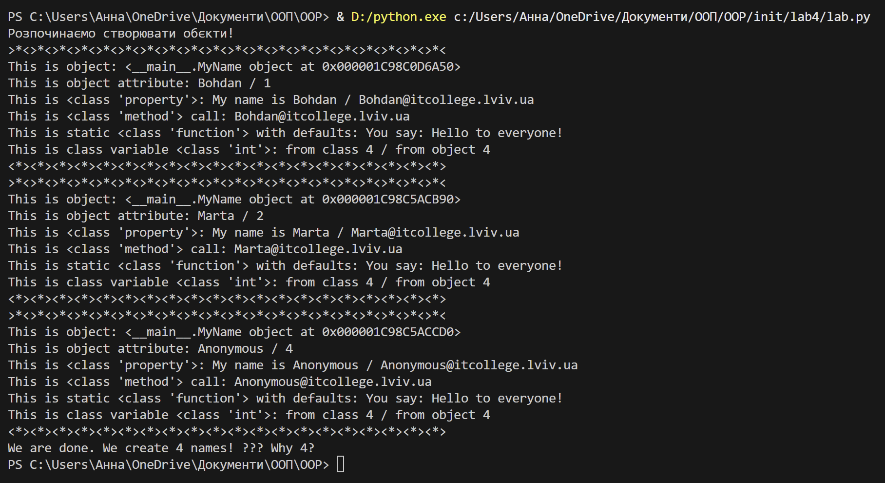
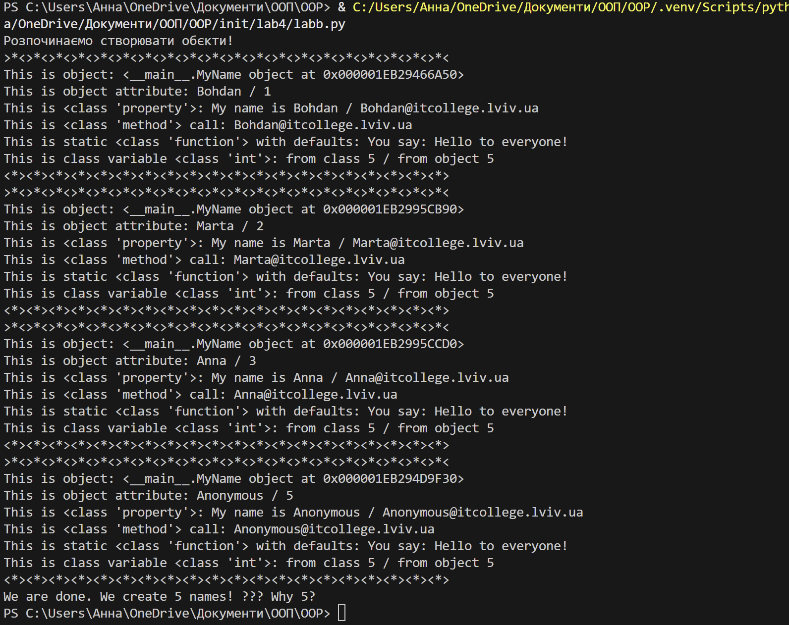
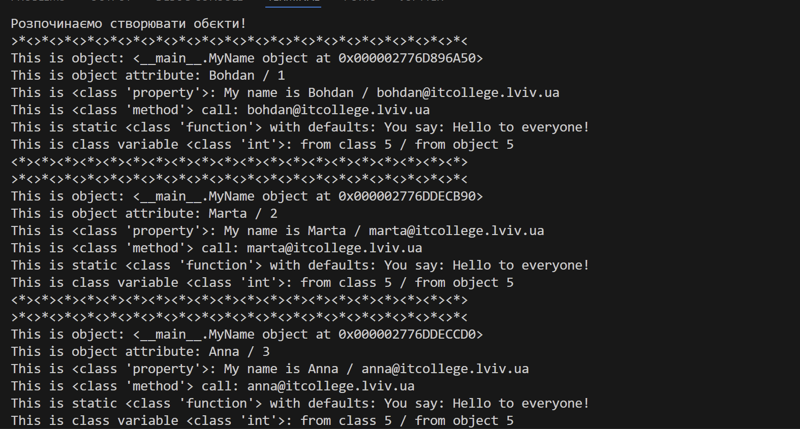
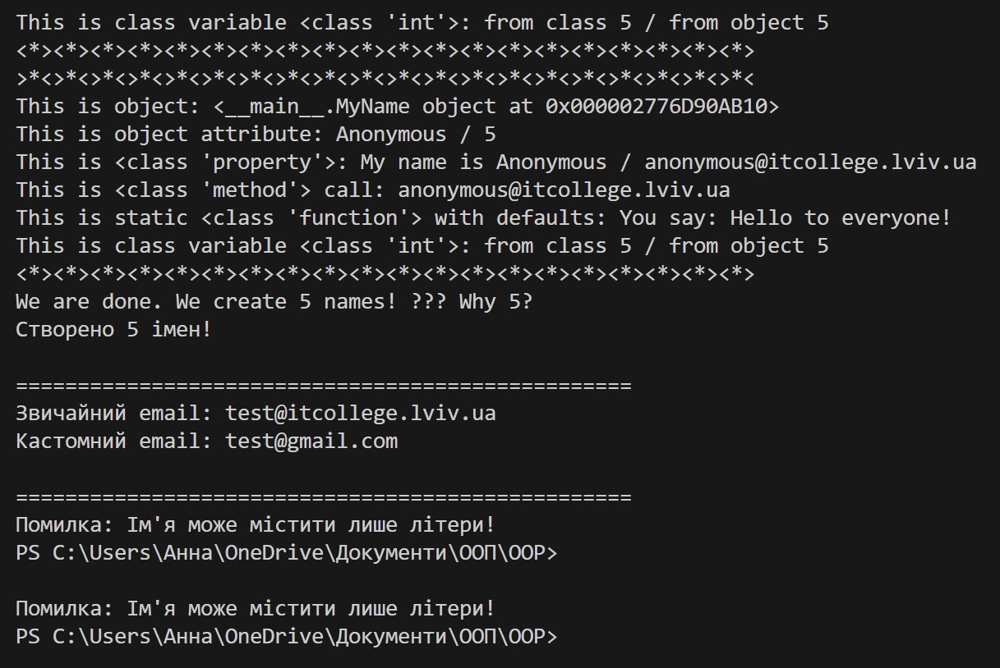

# Тема: Знайомство з ООП
## Мета: Навчитися використовувати основні принципи ООП, відзначити конструкцію побудови класу та створення об’єктів та навчитися працювати з ними.
- ### Перша програма на ООП
[посилання на файл з програмою](lab.py)


- ### Приклади, які розглядали на лекції
[посилання на файл з програмою](lab.ipynb)
- ### Модифікована програма
[посилання на файл з програмою](lab1.py)


- ### Відповіді на запитання 
#### *Чому коли передаємо значення None - створити об'єкт з іменем Anonymous?*
Бо в коді є перевірка: якщо name=None, то використовується anonymous_user() який завжди повертає "Anonymous". Це запобігає помилкам.
#### *Як змінити текст привітання при виклику методу say_hello()? Допишіть цю частину коду.*
Просто передати свій текст в дужках:
```python
print(MyName.say_hello("Привіт!"))
```
#### *Порахуйте кількість імен у списку namesта порівняйте із наведеним результатом. Дайте чому відповідь маємо різну кількість імен?*
None теж створює об'єкт (Anonymous), тому всі 4 елементи з списку створюють по об'єкту.
- ### Індивідуальне завдання 
[посилання на файл з програмою](labb.py)




[метод, який додає рядок із записом у файл](users.txt)
