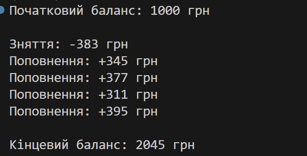
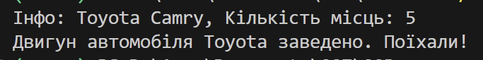
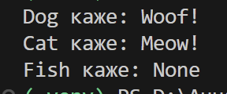
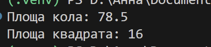
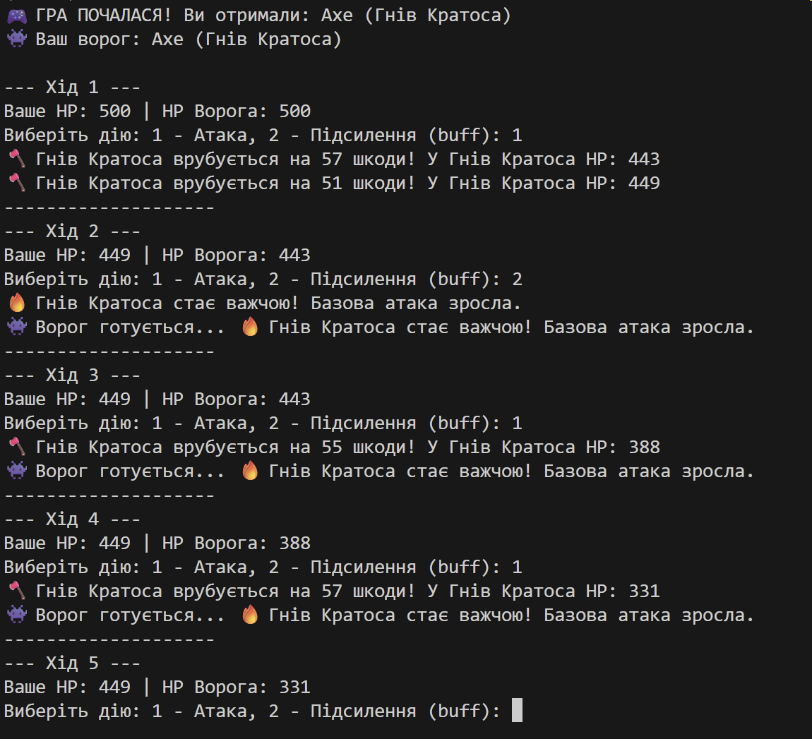

# **Тема:** Основні парадигми ООП
## **Мета:** Ознайомитися з ключовими поняттями об'єктно-орієнтованого програмування (ООП) у Python та навчитися реалізовувати їх у власних класах на прикладі ігрової симуляції.
### Виконання роботи:
- ### Приклади, які розглядали на лекції
[посилання на файл з програмою](note.ipynb)
- #### **Інкапсуляція**
[посилання на файл з програмою](lab1.py)
```python
import random

class BankAccount:
    def __init__(self, owner, balance):
        self.owner = owner  # публічний атрибут
        self.__balance = balance  # приватний атрибут (інкапсуляція)

    def deposit(self, amount):
        self.__balance += amount
        print(f"Поповнення: +{amount} грн")

    def withdraw(self, amount):
        if amount <= self.__balance:
            self.__balance -= amount
            print(f"Зняття: -{amount} грн")
            return amount
        else:
            print(f"Спроба зняти {amount} грн: Недостатньо коштів!")
            return "Insufficient funds"

    def get_balance(self):
        return self.__balance

# Створюємо об'єкт
account = BankAccount("Bohdan", 1000)
print(f"Початковий баланс: {account.get_balance()} грн\n")

# Цикл для виконання 5 випадкових операцій
for i in range(5):
    action = random.choice(['deposit', 'withdraw'])
    amount = random.randint(100, 500) # випадкова сума від 100 до 500
    
    if action == 'deposit':
        account.deposit(amount)
    else:
        account.withdraw(amount)

# Виведення кінцевого результату
print(f"\nКінцевий баланс: {account.get_balance()} грн")
```

- #### **Наслідування**
[посилання на файл з програмою](lab2.py)
```python
class Vehicle:
    def __init__(self, brand, model):
        self.brand = brand
        self.model = model

    def display_info(self):
        return f"{self.brand} {self.model}"

    # Додаємо новий метод у базовий клас
    def start_engine(self):
        return f"Двигун автомобіля {self.brand} заведено. Поїхали!"

class Car(Vehicle):
    def __init__(self, brand, model, seats):
        super().__init__(brand, model)
        self.seats = seats

    def display_info(self):
        # Використовуємо super() для розширення логіки батьківського методу
        return f"{super().display_info()}, Кількість місць: {self.seats}"

# Створюємо об'єкт класу Car
my_car = Car("Toyota", "Camry", 5)

# 1. Викликаємо метод, який є в самому класі Car
print(f"Інфо: {my_car.display_info()}")

# 2. Викликаємо НОВИЙ метод, який ми створили в Vehicle, через об'єкт Car
# Це працює завдяки наслідуванню!
print(my_car.start_engine())
```

- #### **Поліморфізм**
[посилання на файл з програмою](lab3.py)
```python
class Animal:
    def speak(self):
        # Батьківський метод нічого не робить
        pass

class Dog(Animal):
    def speak(self):
        return "Woof!"

class Cat(Animal):
    def speak(self):
        return "Meow!"

# Створюємо клас Fish без власного методу speak
class Fish(Animal):
    pass

# Перевірка
animals = [Dog(), Cat(), Fish()]

for animal in animals:
    print(f"{type(animal).__name__} каже: {animal.speak()}")
```

- #### **Абстракція**
[посилання на файл з програмою](lab4.py)
```python
from abc import ABC, abstractmethod

class Shape(ABC):
    @abstractmethod
    def area(self):
        """Метод для обчислення площі, який мають реалізувати всі фігури"""
        pass

class Circle(Shape):
    def __init__(self, radius):
        self.radius = radius

    def area(self):
        return 3.14 * self.radius ** 2

# Додаємо новий клас Квадрат
class Square(Shape):
    def __init__(self, side):
        self.side = side

    def area(self):
        # Реалізуємо абстрактний метод: площа квадрата = сторона в квадраті
        return self.side ** 2

# Використання
circle = Circle(5)
square = Square(4)

print(f"Площа кола: {circle.area()}")  # 78.5
print(f"Площа квадрата: {square.area()}") # 16
```

- #### **Використання парадигми для створення простої гри**
[посилання на файл з програмою](lab.py)
```python
from abc import ABC, abstractmethod
from random import randint, choice

# 1. АБСТРАКЦІЯ
class Item(ABC):
    def __init__(self, name: str, health=500):
        self.name = name
        self.health = health
    
    @abstractmethod
    def attack(self, another_item):
        pass

    @abstractmethod
    def buff(self):
        """Метод для підсилення зброї (заточування, прицілювання тощо)"""
        pass

# 2. НАСЛІДУВАННЯ ТА ПОЛІМОРФІЗМ
class Sword(Item):
    def __init__(self, name, attack_power: int):
        super().__init__(name=name)
        # 3. ІНКАПСУЛЯЦІЯ
        self.__attack_power = attack_power 
        self._sharp = 0
    
    def attack(self, another_item: Item):
        current_attack = self.__attack_power + self._sharp + randint(0, 10)
        another_item.health -= current_attack
        return f"⚔️ {self.name} січе на {current_attack} шкоди! У {another_item.name} HP: {max(0, another_item.health)}"
    
    def buff(self):
        self._sharp += 5
        return f"✨ {self.name} заточено! Поточна гострота: +{self._sharp}"

class Axe(Item):
    def __init__(self, name, attack_power: int):
        super().__init__(name=name)
        self.__attack_power = attack_power
    
    def attack(self, another_item: Item):
        current_attack = self.__attack_power + randint(0, 25) # Вищий розкид шкоди
        another_item.health -= current_attack
        return f"🪓 {self.name} врубується на {current_attack} шкоди! У {another_item.name} HP: {max(0, another_item.health)}"

    def buff(self):
        # Сокира просто лютує, додаючи до базової атаки
        self.__attack_power += 2
        return f"🔥 {self.name} стає важчою! Базова атака зросла."

# НОВИЙ ТИП ЗБРОЇ - ЛУК
class Bow(Item):
    def __init__(self, name, attack_power: int, range_power: int):
        super().__init__(name=name)
        self.__attack_power = attack_power
        self.range_power = range_power # Специфічний параметр для лука
    
    def attack(self, another_item: Item):
        current_attack = self.__attack_power + randint(5, 15) + self.range_power
        another_item.health -= current_attack
        return f"🏹 {self.name} випускає стрілу на {current_attack} шкоди! У {another_item.name} HP: {max(0, another_item.health)}"

    def buff(self):
        self.range_power += 1
        return f"🎯 {self.name} перезаряджено. Дальність прицілювання зросла до {self.range_power}!"

# --- ЛОГІКА ГРИ ---

# Списки для випадкового вибору
weapon_types = [
    lambda: Sword("Ескалібур", 40),
    lambda: Axe("Гнів Кратоса", 35),
    lambda: Bow("Око Сокола", 30, 10)
]

player = weapon_types[randint(0, 2)]()
enemy = weapon_types[randint(0, 2)]()

print(f"🎮 ГРА ПОЧАЛАСЯ! Ви отримали: {type(player).__name__} ({player.name})")
print(f"👾 Ваш ворог: {type(enemy).__name__} ({enemy.name})\n")

round_num = 1
while player.health > 0 and enemy.health > 0:
    print(f"--- Хід {round_num} ---")
    print(f"Ваше HP: {player.health} | HP Ворога: {enemy.health}")
    
    # Хід гравця
    choice_action = input("Виберіть дію: 1 - Атака, 2 - Підсилення (buff): ")
    if choice_action == "1":
        print(player.attack(enemy))
    else:
        print(player.buff())
    
    if enemy.health <= 0:
        print(f"\n🏆 ПЕРЕМОГА! {enemy.name} подолано.")
        break
    
    # Хід комп'ютера (випадковий)
    enemy_action = randint(1, 2)
    if enemy_action == 1:
        print(enemy.attack(player))
    else:
        print(f"👾 Ворог готується... {enemy.buff()}")

    if player.health <= 0:
        print(f"\n💀 ВИ ПРОГРАЛИ! {player.name} зламано.")
        break
    
    round_num += 1
    print("-" * 20)
```

### Висновок
У ході виконання лабораторної роботи були опановані чотири фундаментальні принципи об'єктно-орієнтованого програмування (ООП) на мові Python:
- Абстракція: за допомогою модуля abc створено базовий клас Item, який визначає загальну логіку гри, не розкриваючи деталей конкретної зброї.
- Інкапсуляція: використання приватних атрибутів (наприклад, __attack_power) дозволило захистити внутрішні дані об’єктів від прямого втручання ззовні, забезпечуючи доступ до них лише через спеціальні методи та властивості (@property).
- Наслідування: класи Sword, Axe та Bow успішно успадкували спільні властивості від базового класу, що дозволило уникнути дублювання коду та легко розширити функціонал гри.
- Поліморфізм: реалізовано однакові імена методів (attack(), buff()) для різних класів, які виконують унікальні дії залежно від типу об'єкта.

Практична реалізація ігрової симуляції продемонструвала, як ООП допомагає створювати гнучкі та масштабовані системи, де взаємодія між різними об'єктами відбувається через уніфікований інтерфейс. Використання генератора випадкових чисел додало динамічності процесу, імітуючи реальні умови роботи програми.