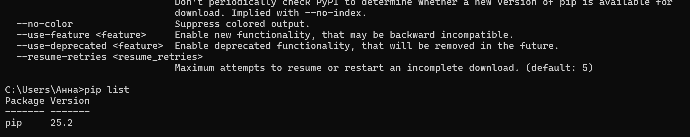
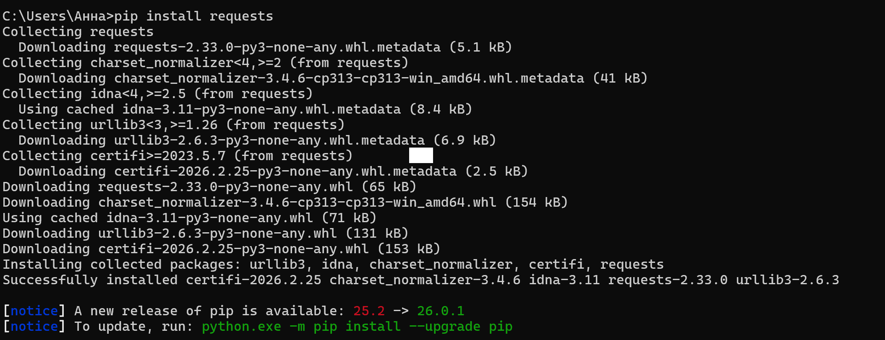
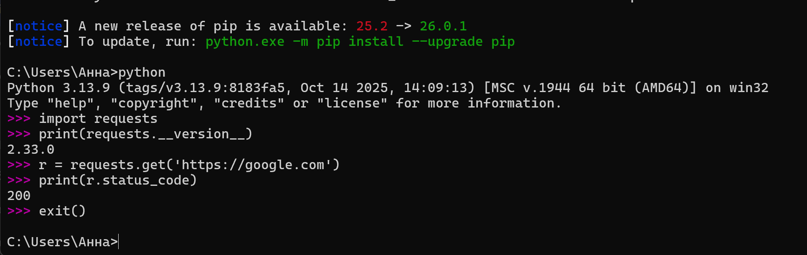
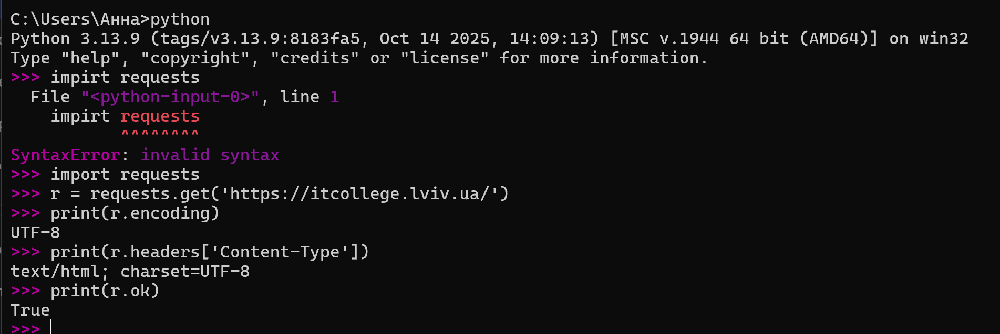
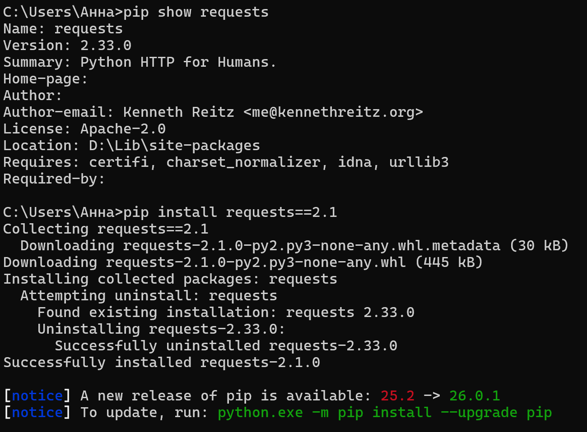
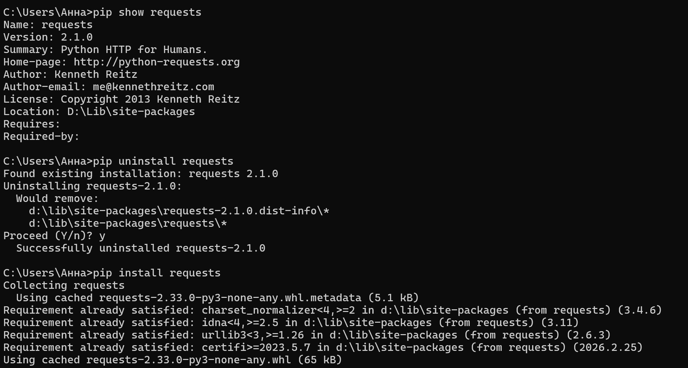
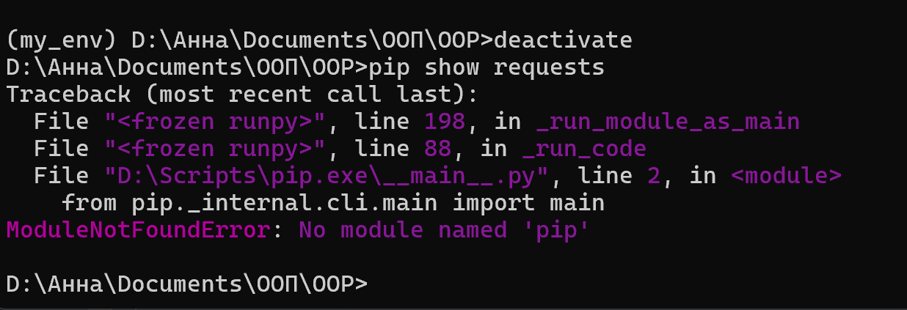
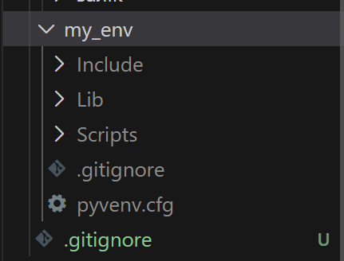
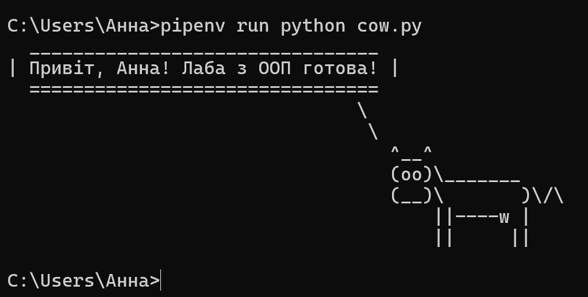

# **Тема:** Віртуальні середовища
### Виконання роботи:
- ### **Основи роботи зі сторонніми бібліотеками**
### завдання 1-2:

### завдання 3-6:

### завдання 7-8:

-  ### **Робота у віртуальному середовищі**
### завдання 1-3:

Остання команда pip show requests вивела помилку. Тому що бібліотека requests була встановлена тільки всередині віртуального середовища my_env. Як тільки я прописаля deactivate, я вийшла з цього середовища. У глобальній системі цієї бібліотеки немає, бо середовища повністю ізольовані.

### завдання 4:

Для віртуального середовища потрібно ігнорувати папку, де зберігаються самі файли середовища (інтерпретатор, скрипти та бібліотеки), щоб не перевантажувати репозиторій гігабайтами службових файлів. У моєму випадку це папка: my_env/. Також гарним тоном вважається додавати в .gitignore такі папки та файли: __pycache__/ (тимчасові файли Python); .venv/ (інша популярна назва середовища); .env (файли з секретними паролями)
- ### **Робота з Pipenv**
### завдання 1-2:
install — встановлює бібліотеки та автоматично створює віртуальне середовище, якщо його ще немає.
uninstall — видаляє бібліотеку з проекту.
shell — активує віртуальне середовище (замість довгих шляхів Scripts/activate).
run — запускає твій скрипт безпосередньо всередині віртуального середовища.
lock — створює спеціальний файл Pipfile.lock, який «заморожує» версії бібліотек, щоб на іншому комп'ютері все працювало так само.
check — перевіряє твої бібліотеки на наявність дірок у безпеці.
graph — показує дерево залежностей (яка бібліотека використовує яку).
### завдання 3-4:
**Pipfile** - Це текстовий файл, який легко читати людині. У ньому записані:

[packages]: Список бібліотек, які я встановила

[requires]: Версія Python, яку я вказала 

[source]: Звідки Pipenv бере бібліотеки 

**Pipfile.lock** - Це величезний файл зі складним кодом (JSON), який не призначений для редагування вручну.

У ньому зафіксовані точні версії всіх бібліотек та їхніх "під-бібліотек".

Для кожної бібліотеки там є хеш-сума, щоб гарантувати безпеку та те, що код не зміниться при перенесенні на інший комп'ютер.

### завдання 5-8:
програма main.py успішно вивела вміст сторінки при запуску через pipenv run

Я обрала бібліотеку cowsay, яка дозволяє виводити текст у формі ASCII-графіки. Документацію знайдено на PyPI, де вказано основний метод .cow()

- ### **Робота зі змінними середовищами**
Якщо запустити просто через python env_test.py:
Програма виведе: Змінна не знайдена або видасть помилку.
Тому що звичайний Python не знає про існування файлу .env. Для нього це просто файл у папці, який він не читає автоматично.
Якщо запустити через pipenv run python env_test.py:
Програма виведе: Значення змінної IT_TEST = HelloWorld.
Тому що Pipenv має вбудовану функцію: перед запуском коду він заглядає у файл .env, "всмоктує" звідти всі змінні та передає їх у віртуальне середовище.
