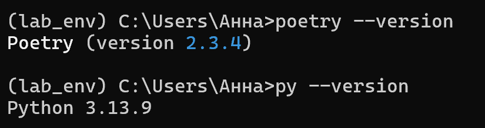
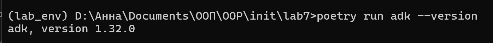
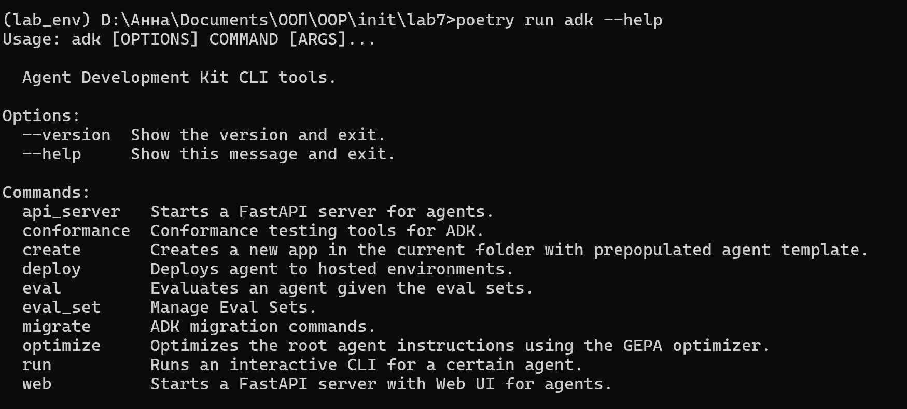
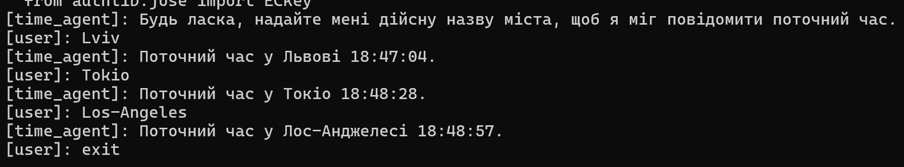
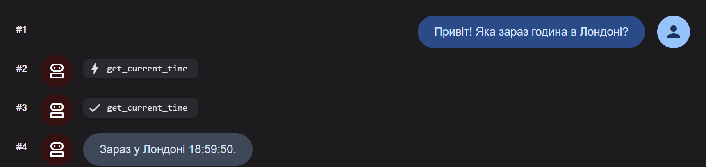
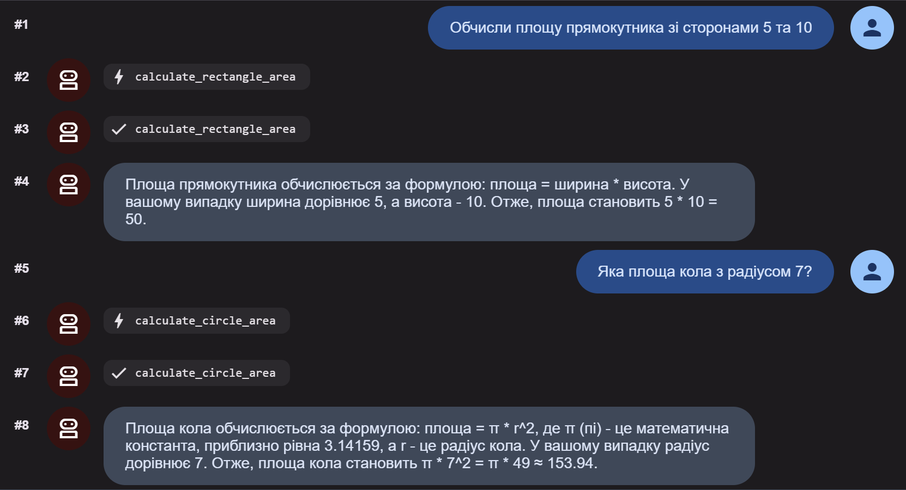
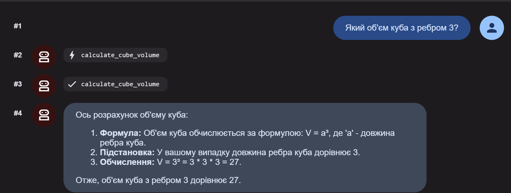
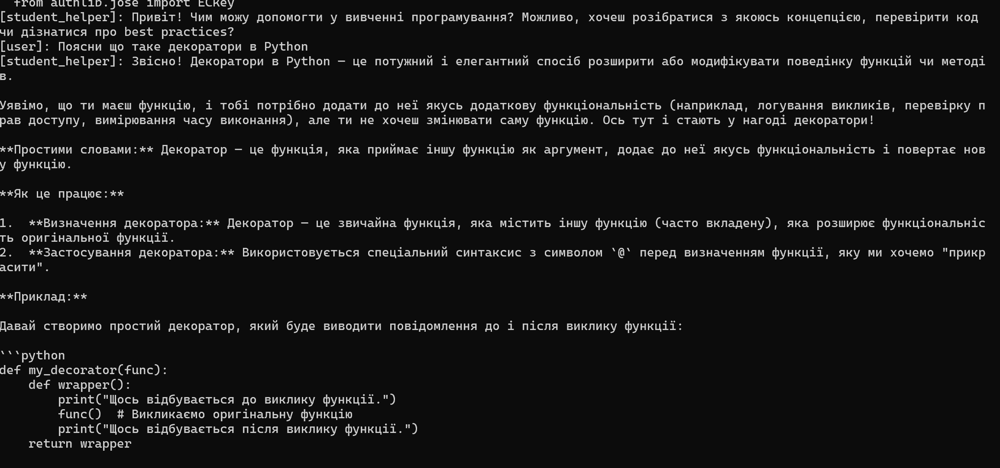
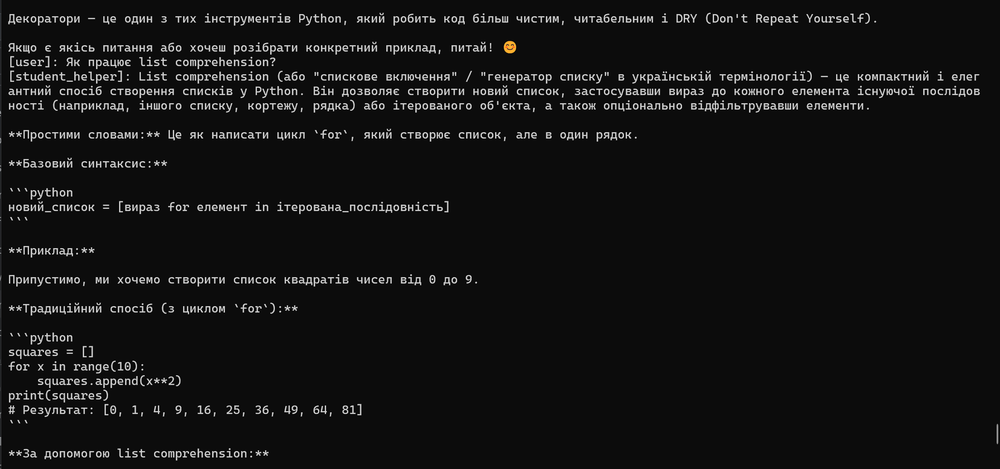
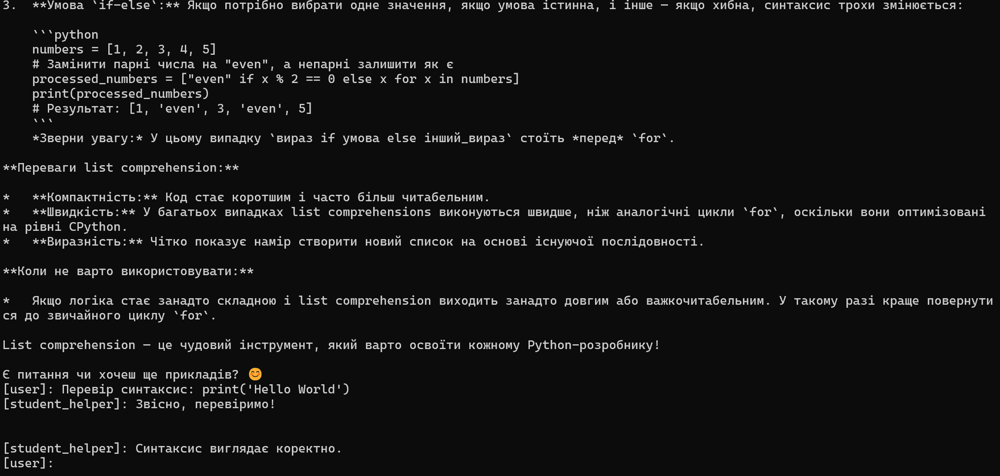

# **Тема:** AI Агенти з Google ADK
# **Мета:** Навчитись створювати AI агентів з використанням Google ADK (Python) та Poetry для управління залежностями проекту
### Виконання роботи:
- ### **Підготовка робочого середовища**

- ### **Встановлення Google ADK**
Навіщо потрібен файл poetry.lock?

Це "знімок" стану проєкту. У той час як pyproject.toml каже "мені потрібен Google ADK приблизно такої версії", файл poetry.lock записує точну версію (до останньої цифри) самої бібліотеки та всіх її сотень допоміжних модулів. Це гарантує, що у будь-кого іншого проєкт розгорнеться точно з такими ж параметрами, і не виникне помилок через оновлення бібліотек.

create — створює шаблон нового AI-агента.

run — запускає агента в консолі для живого спілкування.

web — відкриває графічний інтерфейс у браузері для тестування.

- ### **Створення простого агента з інструментом**
1. Що таке Agent клас?

Клас Agent у бібліотеці Google ADK — це "керуючий центр" або "мозок" застосунку. Це об'єкт, який інкапсулює (об’єднує) три ключові речі:
- Модель (LLM): Вказує, яку саме нейромережу використовувати (наприклад, gemini-2.5-flash).
- Контекст та інструкції: Параметр instruction задає роль агента (хто він, як має розмовляти, якою мовою).
- Можливості (Інструменти): Список функцій, до яких агент має доступ.
Він відповідає за те, щоб прийняти твоє запитання, проаналізувати його, вирішити, чи потрібен йому додатковий інструмент, і сформувати фінальну відповідь.

2. Для чого потрібен параметр tools?

Параметр tools — це список зовнішніх функцій, які агент може викликати за потреби.
Звичайна нейромережа "закрита" у своїх знаннях, отриманих під час навчання. Вона не знає, яка зараз година на комп'ютері або яка погода прямо зараз. Параметр tools дає агенту "руки":
Якщо запитати "Котра година?", агент побачить у списку tools функцію get_current_time. Він сам вирішить її викликати, отримає результат і передасть його.Це перетворює чат-бота на справжню автономну систему.

3. Що робить функція get_current_time?

Це приклад "Інструменту" (Tool). Це звичайна Python-функція, яка:
- Приймає аргумент city (назву міста).
- Використовує стандартну бібліотеку datetime для отримання системного часу.
- Повертає результат у вигляді словника (dict).

Це критично важливо: інструменти в ADK повинні повертати структуровані дані (JSON-подібні), щоб нейромережа могла їх легко прочитати та вставити у свою відповідь.
- ### **Запуск агента через командний рядок**

- ### **Запуск агента через веб-інтерфейс**

- ### **Створення агента з математичними інструментами**

- ### **Створення агента-помічника для студентів**

Під час виконання лабораторної роботи та тестування створених агентів було зафіксовано помилки 429 Resource Exhausted та 403 Permission Denied.

Помилка 429 - виникає через перевищення добової або хвилинної квоти безкоштовного тарифного плану. Оскільки агенти надсилають декілька прихованих запитів для аналізу та виклику інструментів, ліміт у 20 запитів на день вичерпується дуже швидко.

Помилка 403 - пов'язана з тимчасовим блокуванням доступу до проєкту з боку сервісу Google AI Studio. Це відбувається через автоматичний захист Google при частій зміні API-ключів, або через блокування мережевої IP-адреси при роботі з декількох пристроїв.

Для успішного завершення тестування першої половини роботи було застосовано перехід на легші моделі (gemini-2.5-flash-lite) та оновлено API-ключі в нових проєктах.

- ### **Висновок**
У ході виконання лабораторної роботи було успішно опановано процес розробки автономних AI-агентів за допомогою фреймворку Google ADK на мові програмування Python та управління залежностями через Poetry. Під час створення та тестування агентів (Time Agent, Math Agent та Student Helper) було детально вивчено механізм прив'язки функцій-інструментів (Function Calling), а також принципи роботи моделей Gemini. Незважаючи на технічні обмеження безкоштовного тарифу та виникнення помилок квот (429 та 403), отриманий досвід дозволив на практиці розібратися з безпечним керуванням API-ключами, оптимізацією системних інструкцій та вирішенням реальних проблем, які виникають під час взаємодії з великими мовними моделями.